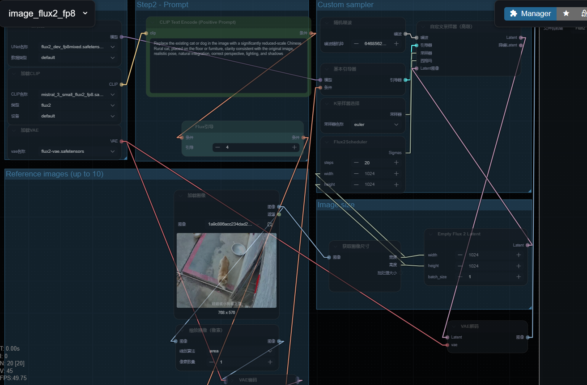
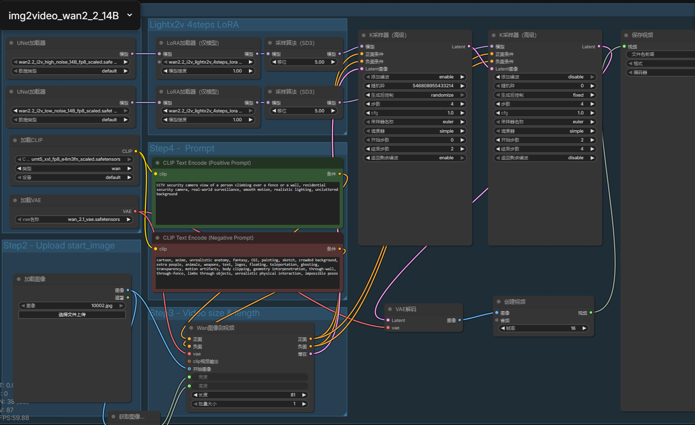
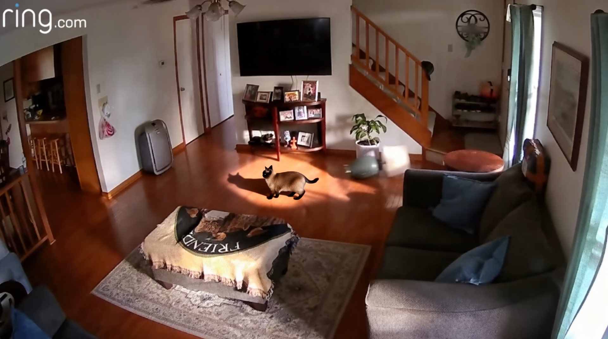
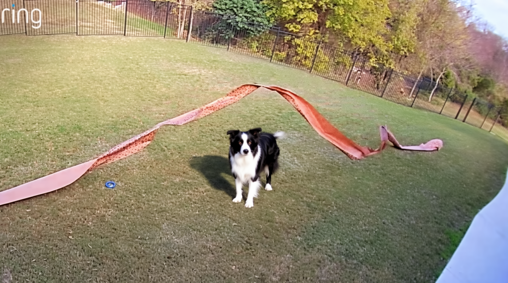

# ComfyUI 数据集生成流水线

中文版 | [English](./README.md)

## 项目概述

本项目为合成数据结果展示：在本地服务器部署 ComfyUI，用于生成面向智能安防系统的合成数据集，涵盖图生图与图生视频两类工作流。

## 项目内容

<table align="center">
  <tr>
    <th>类型</th>
    <th>模型</th>
    <th>数量</th>
    <th>目标</th>
  </tr>
  <tr>
    <td>图生图</td>
    <td>FLUX.2</td>
    <td>40,000</td>
    <td>监控视角下的猫狗图像</td>
  </tr>
  <tr>
    <td>图生视频</td>
    <td>Wan2.2</td>
    <td>10,000</td>
    <td>监控视角下的行人翻越行为视频</td>
  </tr>
</table>

## 在 ComfyUI 搭建工作流

### 图生图工作流

  

**模型**：FLUX.2  
**提示词**：将图像中现有的猫或狗替换为明显缩小比例的猫或狗，放置在地板或家具上，清晰度与原图像一致，姿态逼真，自然融合，透视、光照、阴影正确。
**输出**：4 万张猫狗图像

### 图生视频工作流

  

**模型**：Wan2.2  
**提示词**：监控摄像头视角，静态CCTV角度，成年男性或成年女性从房间内部通过窗户爬出或爬过阳台栏杆到外面，非暴力，非性，谨慎或偶然的运动，住宅公寓或房屋阳台/窗户设置，逼真的照明，逼真的人体解剖和运动，整洁的背景，逼真的物理互动，服从与环境的碰撞，自然运动
**输出**：1 万段行人翻越行为视频

## 生成示例

### 图像样例

  
  

### 视频样例

  <video src="./video/climbing1.mp4" controls width="400" style="margin: 10px;"></video>
  <video src="./video/climbing2.mp4" controls width="400" style="margin: 10px;"></video>

